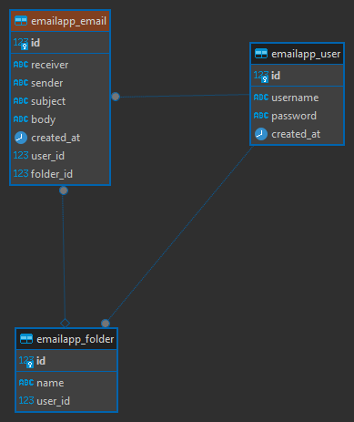

# Database Documentation

## 1. Overview
This document provides documentation for the database migrated from a Django application. The database consists of tables representing users, folders, and emails.

## 2. Schema Diagram

## 3. Tables

### 3.1. User
- **Description**: Represents a user in the system.
- **Columns**:
  - `id`: Primary Key, Auto-incremented integer.
  - `username`: CharField. The username of the user, unique, and limited to 30 characters.
  - `password`: CharField. The password of the user, limited to 30 characters.
  - `created_at`: DateTimeField. The timestamp when the user was created.

### 3.2. Folder
- **Description**: Represents a folder owned by a user to organize emails.
- **Columns**:
  - `id`: Primary Key, Auto-incremented integer.
  - `name`: CharField. The name of the folder, limited to 50 characters.
  - `user_id`: Foreign Key to the `User` table, CASCADE on deletion.

### 3.3. Email
- **Description**: Represents an email message.
- **Columns**:
  - `id`: Primary Key, Auto-incremented integer.
  - `user_id`: Foreign Key to the `User` table, CASCADE on deletion.
  - `receiver`: EmailField. The email address of the receiver.
  - `sender`: EmailField. The email address of the sender.
  - `subject`: CharField. The subject of the email, limited to 50 characters.
  - `body`: TextField. The body of the email.
  - `folder_id`: Foreign Key to the `Folder` table, SET_NULL on deletion, NULLable.

## 4. Indexes
- Indexes are automatically created for primary keys and foreign keys.

## 5. Triggers
- No triggers defined in the database.

## 6. Security and Permissions
- Permissions are managed by the Django application and Django's built-in authentication system.

## 7. Backup and Recovery
- Database backups are managed as per the DBMS (Database Management System) guidelines.

## 8. Dependencies
- The database does not have external dependencies.

## 9. Tools and Technologies Used
- Django ORM for database management.

---

This documentation provides an overview of the database schema, tables, columns, and basic details about each component. It's crucial to keep this documentation updated as changes are made to the database schema or structure.